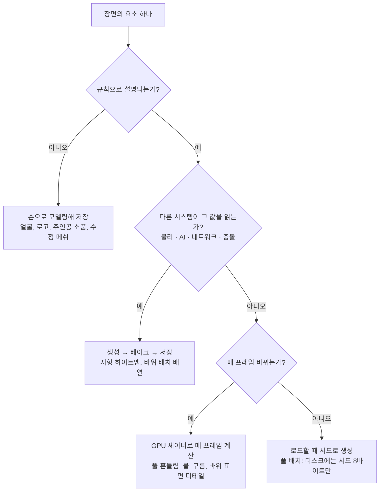

# 계산하는 3D, 저장하는 3D 학습 노트

2026-10-05

## 한 문장 요약

데모씬 인트로는 3D 장면을 **수식으로 계산**해서 실행 시점에 만들고, 게임 엔진은 아티스트가 만든 장면을 **데이터로 저장**해 두었다가 읽어서 그린다. 실무의 답은 둘 중 하나를 고르는 것이 아니라, 장면의 요소마다 "규칙으로 설명되는가"를 물어 계산할 것과 저장할 것을 나누는 것이다.

비유하면 이렇다. 요리사가 레시피(수식) 몇 줄만 들고 다니며 현장에서 요리하는 것이 데모씬이고, 완성된 요리를 냉동 포장(메쉬 파일)해 가져가 전자레인지(엔진)에 돌리는 것이 게임 엔진이다.

이 노트는 세 개의 실습 페이지(나란히 비교, 패턴 실험대, 게임 레벨)에서 다룬 내용을 한 곳에 정리한 것이다. 각 섹션은 혼자 읽어도 되고, 마지막의 실습 순서를 따라가며 읽어도 된다.

## 방식 A · 데모씬: 장면을 계산한다

4k 인트로의 실행 파일은 4,096바이트이다. 이 안에 3D 영상과 음악이 모두 들어가며, 정점 좌표나 텍스처 이미지를 저장할 공간이 없으므로 모든 것을 함수로 표현한다.

**SDF와 레이마칭.** 물체를 삼각형 메쉬로 두지 않고 "공간의 임의의 점에서 물체 표면까지의 거리"를 돌려주는 부호 거리 함수(SDF)로 정의한다. 카메라에서 픽셀마다 광선을 쏘고, 현재 지점의 거리만큼 안전하게 전진하는 것을 반복해 표면을 찾는다.

```glsl
float sphere(vec3 p, float r) { return length(p) - r; }   // 구: 중심 거리 - 반지름
float plane(vec3 p)          { return p.y + 1.0; }        // 바닥
float map(vec3 p)            { return min(sphere(p, 1.0), plane(p)); }

// 레이마칭: 표면까지의 거리만큼 전진
float t = 0.0;
for (int i = 0; i < 64; i++) {
    float d = map(ro + rd * t);
    if (d < 0.001) break;
    t += d;
}
```

이 20줄이면 구와 바닥이 있는 3D 장면이 나온다. 정점 데이터는 0바이트이고, 구를 100개로 늘리고 싶으면 `mod(p, 2.0)` 한 줄로 공간을 반복시키면 된다.

**노이즈.** 지형, 구름, 나무 같은 복잡한 것은 노이즈 함수로 만든다. 2009년 4k 인트로 "Elevated"의 산맥은 fBm 노이즈 함수 하나이다. 음악도 4klang 같은 소프트웨어 신디사이저가 악보 수백 바이트로 실시간 합성한다.

**64k.** Farbrausch의 .kkrieger(96k FPS)나 Debris(177KB)는 프로시저럴 메쉬·텍스처 생성기를 내장해, "박스를 만들고 돌출시키고 노이즈를 입히라"는 명령 목록만 저장하고 실행 시 수 MB의 메쉬와 텍스처를 메모리에서 생성한다. 로딩 바가 있는 이유가 이것이다.

**어셈블리의 실제 역할.** 현대 4k 인트로는 대부분 C 코드와 GLSL 셰이더를 Crinkler 같은 압축 링커로 묶은 것이다. 순수 어셈블리는 256바이트 인트로나 옛 DOS 시대 작품에 해당하고, 그 목적은 속도가 아니라 압축 후 바이트 수를 한 자리라도 줄이는 것이다.

## 방식 B · 게임 엔진: 장면을 저장한다

같은 구 하나를 게임 엔진에서 다루는 과정은 다섯 단계이고, 각 단계가 파일을 하나씩 만든다.

1. **모델링.** Blender에서 UV 스피어를 만든다. 정점 482개, 삼각형 960개가 생긴다.
2. **UV 전개와 텍스처.** 표면을 2D로 펼치고 Substance Painter에서 2048×2048 텍스처를 칠한다. 알베도, 노멀, 러프니스 맵 세 장이 나온다.
3. **익스포트.** FBX나 glTF로 저장한다. 정점 위치, 노멀, UV, 삼각형 인덱스가 바이너리로 기록된다.
4. **임포트와 배치.** Unity나 Unreal에 끌어다 놓고 머티리얼을 연결해 씬에 배치한다.
5. **렌더링.** 엔진이 매 프레임 정점 버퍼를 GPU에 보내고, 래스터라이저가 삼각형을 픽셀로 변환한다.

```csharp
// 엔진 쪽 코드는 구가 어떤 모양인지 모른다. 파일을 읽어 놓기만 한다.
var prefab = Resources.Load<GameObject>("Models/Rock");
var rock = Instantiate(prefab, new Vector3(0, 0, 5), Quaternion.identity);
```

같은 물체를 두 방식으로 표현할 때의 디스크 용량이다.

| 항목 | 계산 (4k 인트로) | 저장 (게임 엔진 자산) |
| --- | --- | --- |
| 구 하나의 형상 | 수식 1줄, 약 30 B | 정점 482개, 약 15 KB |
| 구 표면의 재질 | 노이즈 함수, 약 200 B | 텍스처 3장, 약 12 MB (비압축) |
| 지형 1 km² | 노이즈 함수, 약 500 B | 하이트맵 + 텍스처, 수십에서 수백 MB |

## 축별 비교

두 방식은 거의 모든 축에서 서로 반대의 장단점을 가진다. 어느 쪽이 유리한지는 "무엇을 만드는가"에 따라 축별로 다르다.

| 축 | 계산 (데모씬) | 저장 (게임 엔진) |
| --- | --- | --- |
| 형상 표현 | 거리 함수, 수식, 생성 규칙 | 삼각형 메쉬, 정점 배열 |
| 렌더링 | 레이마칭 (픽셀마다 광선 추적) | 래스터라이제이션 (삼각형을 픽셀로 투영) |
| 제작 주체 | 수학을 쓰는 프로그래머 한두 명 | 모델러, 텍스처, 리깅, 애니메이션 팀 |
| 표현 자유도 | 수식으로 쓸 수 있는 것만. 비정형은 매우 어려움 | 상상한 것 무엇이든 가능 |
| 수정 비용 | 상수 하나로 전체가 바뀜. 특정 돌 하나만 고치기는 어려움 | 특정 돌 하나는 쉽게. 전체 스타일 변경은 자산 전부 재작업 |
| 성능이 비례하는 것 | 픽셀 수 × 스텝 수 | 정점 수 × 드로우콜 |
| 파일 크기 | 수 KB | 수 GB |
| 결정성 | 같은 시드마다 어디서나 같은 결과 | 데이터 그대로. 변형은 불가 |
| 반복과 프랙탈 | mod 한 줄로 무한, 거의 공짜 | 인스턴싱으로 완화. LOD 단계별 별도 메쉬 |
| 충돌·반사·그림자 | 거리 함수가 공간 정보 자체라 자연스러움 | 별도 기법 (콜라이더, 환경맵, 섀도맵) 필요 |

## 같은 장면, 두 방식

"사막 위에 거대한 금속 구가 떠 있는 장면"을 만든다고 하자. 요구사항이 바뀔 때 어느 쪽이 쉽고 어느 쪽이 어려운지가 반대로 갈린다.

| 요구 | 계산 방식 | 저장 방식 |
| --- | --- | --- |
| 사막과 구 만들기 | 노이즈 2줄 + 거리 함수 1줄 | 지형 생성기 → 하이트맵, 구 모델링 + 금속 머티리얼 |
| 구에 사막이 반사되게 | 반사 광선 한 번 더, 5줄 | 리플렉션 프로브 또는 레이트레이싱 기능 |
| 구가 서서히 녹아 흐르게 | 거리 함수에 sin(time) 한 항 | 프레임별 형태 저장 또는 복잡한 버텍스 셰이더 |
| 구에 제조사 로고 새기기 | 거의 불가능. 로고는 수식이 아니다 | 텍스처 한 장 추가 |
| 모래 결 방향 전체 변경 | 상수 하나 | 지형 자산 재생성 |

실제 산업은 둘을 섞는다.

- **게임 엔진 안의 프로시저럴.** No Man's Sky의 행성, Minecraft의 지형은 노이즈 기반 생성이다. Houdini와 Substance Designer는 아티스트가 노드로 생성 규칙을 짜는 도구, 즉 "수식을 GUI로 짜는" 중간 지대다.
- **데모씬 안의 툴.** 64k 팀들은 werkkzeug, Tooll 같은 자체 에디터로 노드를 조립하고, 실행 파일에는 그 노드 그래프만 넣는다.
- **셰이더 아트.** 게임 속 물, 구름, 불, 포털 효과는 거의 다 데모씬식 수학 셰이더다. Shadertoy의 레이마칭 기법이 그대로 AAA VFX에 쓰인다.
- **반대 방향의 극단.** Unreal의 Nanite는 수억 삼각형의 스캔 메쉬를 그대로 넣는 기술로, "계산 대신 저장"을 끝까지 밀어붙인 사례다.

## 하이브리드: 역할 분담의 기준

가장 효율적인 방법은 두 방식을 역할로 나누는 것이다. 규칙으로 설명되는 것은 계산하고, 규칙이 없는 것은 저장하고, 계산한 결과를 저장 형식으로 굽는(베이크) 지점을 분명히 정한다.

| 범주 | 예 | 방식 | 이유 |
| --- | --- | --- | --- |
| 규칙으로 완전히 설명됨 | 지형, 바위 흩뿌리기, 구름, 물, 불, 안개, 눈·비, 풀 흔들림 | 런타임 계산 (셰이더, 노이즈) | 저장하면 용량만 크고 수정이 늦다 |
| 규칙은 있지만 아티스트 손이 필요 | 건물, 도로, 식생 배치, 동굴, 재질 텍스처 | 프로시저럴 생성 후 베이크 | 생성기로 90%를 만들고 사람이 10%를 다듬는다 |
| 규칙이 없음 | 캐릭터 얼굴, 주인공 무기, 로고, 스토리 소품 | 수작업 모델링 후 저장 | 수식으로 표현할 방법이 없다 |

판단 질문은 두 개다. **"이것을 함수로 쓸 수 있는가?"** 그리고 **"플레이어가 이것을 하나하나 기억하는가?"** 기억하는 것(주인공 얼굴, 상징적 건물)은 손으로 만들고, 기억하지 않는 것(배경 바위 3,000개)은 생성한다.

## 추천 파이프라인: 생성 → 베이크 → 저장 → 런타임 셰이더

"사막 오픈월드 레벨 하나"를 만든다고 할 때의 순서다. 각 단계가 어디에서 계산하고 어디에서 저장하는지가 핵심이다.

1. **지형은 노이즈로 생성해 하이트맵으로 베이크한다.** Houdini, World Machine, 혹은 직접 짠 스크립트가 fBm 노이즈로 높이를 계산한다. 결과는 하이트맵 텍스처 한 장으로 저장하고, 런타임에는 엔진의 지형 시스템이 이 데이터를 읽는다. 수정은 노이즈 파라미터를 바꾸고 다시 굽는 것으로 끝난다.
2. **바위와 식생은 규칙으로 배치하고 인스턴스로 저장한다.** 바위 메쉬 다섯 종은 아티스트가 손으로 만든다. 어디에 몇 개 놓을지는 규칙이 정한다(경사 30도 이상에는 바위, 평지에는 풀). 결과는 위치·회전·크기 배열로 저장하고 GPU 인스턴싱으로 한 번에 그린다. 메쉬 다섯 개로 바위 3,000개가 나온다.
3. **재질은 프로시저럴로 만들고 텍스처로 베이크한다.** Substance Designer에서 노이즈 노드를 조립해 사막 모래, 풍화된 바위를 만든다. 결과는 2K 텍스처로 굽는다. 노드 그래프를 저장해 두면 "모래 색을 더 붉게"가 슬라이더 하나로 끝난다.
4. **움직이는 것은 셰이더로 계산한다.** 모래 바람, 열 아지랑이, 물 표면, 구름은 매 프레임 바뀌기 때문에 저장할 수 없다. 버텍스 셰이더에서 풀을 sin(time + position.x)로 흔들고, 프래그먼트 셰이더에서 노이즈로 아지랑이를 만든다.
5. **주인공과 핵심 소품만 손으로 모델링한다.** 전체 작업 시간의 절반 이상을 여기에 쓴다. 플레이어가 가장 오래 보는 것이기 때문이다.

## 코드 레벨의 두 패턴

엔진 안에서 계산과 저장을 섞는 가장 흔한 방법이 두 가지다. 둘 다 "메쉬는 저장하고 나머지는 셰이더가 계산한다"는 구조다.

**패턴 1 · 메쉬는 저장, 변형은 계산.** 정점 데이터는 파일에서 읽되, 움직임은 버텍스 셰이더가 수식으로 만든다. 정점 10만 개를 CPU가 매 프레임 옮기면 수 ms가 들고 수 MB를 GPU로 다시 보내야 하지만, GPU에서는 사실상 공짜다.

```glsl
// 버텍스 셰이더: 저장된 정점 + 계산된 변형
vec3 p = aPos;                                      // 파일에서 온 정점
p += aNrm * 0.15 * sin(6.0 * p.y + 3.0 * uTime);    // 데모씬식 한 줄
gl_Position = uVP * vec4(p, 1.0);
```

**패턴 2 · 메쉬로 실루엣, 셰이더로 디테일.** 큰 형태는 삼각형 몇백 개의 거친 메쉬로 그리고, 표면의 미세 디테일은 프래그먼트 셰이더가 노이즈 기울기로 노멀을 흔들어(범프 매핑) 만든다. 텍스처 용량이 0이고 어느 거리에서 봐도 디테일이 뭉개지지 않는다.

```glsl
// 프래그먼트 셰이더: 저장된 노멀을 계산된 기울기로 흔든다
vec3 n = normalize(vNormal);                        // 메쉬에서
vec3 g = grad(fbm3(p * uFreq));                     // 노이즈 기울기
n = normalize(n - amp * (g - n * dot(g, n)));
// 노멀맵은 같은 식을 한 번 계산해 텍스처에 굽고, 매 프레임 읽는 것이다
```

같은 바위를 네 방식으로 그릴 때의 비용이다 (실험대 4의 값).

| 방식 | 삼각형 | 디스크 | 확대했을 때 |
| --- | --- | --- | --- |
| A 저폴리 그대로 | 320 | 약 8 KB | 각진 면이 보인다 |
| B 고폴리 메쉬 | 81,920 | 약 2 MB | 선명하지만 용량이 크다 |
| C 저폴리 + 노멀맵 512² | 320 | 약 1 MB | 텍셀이 보이기 시작한다 |
| D 저폴리 + 셰이더 노이즈 | 320 | 약 8 KB | 어디서도 선명. 매 픽셀 계산 비용을 낸다 |

## 결정 규칙과 피해야 할 실수

요소 하나마다 세 질문을 순서대로 물으면 네 가지 결과 중 하나로 떨어진다.



규칙이 없으면 손으로 만들고, 규칙이 있어도 다른 시스템이 그 값을 읽으면 베이크해 저장하고, 눈에만 보이는 것은 계산한다.

피해야 할 실수는 두 가지다.

- **수작업 자산을 프로시저럴로 대체하려는 시도.** 캐릭터 얼굴을 수식으로 만들려고 몇 주를 쓰는 경우다. 규칙이 없는 것은 손으로 만드는 것이 빠르다.
- **프로시저럴 결과를 베이크하지 않고 런타임에 전부 계산하는 것.** 지형 높이를 매 프레임 노이즈로 계산하면 충돌 판정, 경로 탐색, 네트워크 동기화가 전부 어려워진다. 한 번 계산해 저장하면 나머지 시스템이 평범한 데이터로 다룰 수 있다. 생성은 자유롭게, 저장은 결정적으로.

## 사례 연구: 듄 런 레벨

세 번째 실습 페이지의 게임 레벨은 위의 규칙을 요소별로 적용한 것이다. 사막 지형 위에서 공을 굴려 수정 12개를 모으는 게임이고, 레벨 전체의 디스크 용량은 200 KB 안쪽이다.

| 요소 | 계산 | 베이크 | 저장 | 디스크 | 읽는 곳 |
| --- | --- | --- | --- | --- | --- |
| 지형 | 노이즈 생성기 | 빌드 시 하이트맵 굽기 | terrain.r16 161×161 | 약 52 KB | 렌더, 충돌, 미니맵 |
| 바위 | 배치 규칙, 셰이더 디테일, 인스턴싱 | 배치 배열 | 메쉬 4종 + 배치 배열 | 약 60 KB | 렌더, 충돌 |
| 풀 | 시드로 로드 시 생성, GPU 흔들림·밟힘 | — | 풀잎 메쉬 1개 + 시드 | 122 B | 렌더만 |
| 수정 | 회전, 발광 | — | 손으로 쓴 메쉬 + 디자이너 좌표 12개 | 약 200 B | 렌더, 수집 판정 |
| 플레이어 | 셰이더 무늬, 구르기 회전 | — | 구 메쉬 1,280 삼각형 | 약 31 KB | 렌더 |
| 하늘·구름·물 | 레이 방향별 노이즈 | — | — | 0 B | 렌더 |
| 효과음 | 오실레이터·노이즈 합성, 속도·콤보로 변조 | — | — | 0 B | 스피커 |
| 점수판·타이머 | 콤보 배수, 시간 보너스, 순위 계산 | — | 상위 5개 기록 (브라우저 localStorage) | 수백 B | HUD, 완주 창, 점수판 |

표에서 읽어 낼 점은 세 가지다. 충돌이 읽는 것(지형, 바위)은 베이크해 저장했고, 눈에만 보이는 것(풀, 하늘)은 저장하지 않았고, 규칙이 없는 것(수정의 좌표)은 사람이 직접 정했다. 게임 화면 아래의 토글로 인스턴싱을 끄면 드로우콜이 수천 개로 늘어 같은 그림에 비용만 올라가는 것을 볼 수 있다.

### 게임 시스템에도 같은 기준이 적용된다

그래픽이 아닌 요소도 "규칙이 있는가, 누가 읽는가"로 나뉜다. 듄 런의 효과음과 점수판이 그 예다.

**효과음은 전부 계산한다.** 오디오 파일이 한 개도 없다. 4k 인트로가 음악을 신디사이저 코드로 만드는 것과 같은 원리로, Web Audio의 오실레이터와 노이즈에 엔벨로프와 필터를 씌워 실행 시점에 만든다.

| 소리 | 만드는 식 |
| --- | --- |
| 수정 수집 | 사인파 + 한 옥타브 위 삼각파 + 배음 하나. 콤보가 오를수록 펜타토닉 음계(E5 → G5 → A5 → C6 → D6)를 한 음씩 올라간다 |
| 구르기 | 핑크 노이즈 루프를 밴드패스 필터에 통과. 속도가 게인과 중심 주파수를 올리고, 물에서는 낮고 먹먹하게 |
| 바위 충돌 | 110 Hz → 45 Hz 사인 슬라이드 + 로패스 노이즈 버스트. 부딪힌 세기에 비례 |
| 물 입수 | 밴드패스 주파수를 1.4 kHz에서 300 Hz로 내리는 노이즈 |
| 완주 | C5-E5-G5-C6 아르페지오. 신기록이면 높은 음 세 개를 덧붙임 |

소리를 파일로 저장했다면 짧은 효과음 여섯 개만 해도 수백 KB가 든다. 수식으로 두면 0바이트이고, "콤보에 따라 음이 올라간다" 같은 변주가 숫자 하나로 끝난다. 반대로 성우 대사나 녹음된 앰비언스처럼 규칙이 없는 소리는 저장해야 한다.

**점수판은 규칙은 계산하고 기록은 저장한다.** 점수 규칙 자체는 수식이다. 수정 하나에 100점, 직전 수집 후 4초 안이면 콤보 배수 ×2부터 ×5, 완주 시 시간 보너스 `max(0, 600 − 5 × 초)`. 이 규칙은 저장할 것이 없다. 그러나 플레이어가 세운 기록은 규칙으로 다시 만들어 낼 수 없는 데이터다. 그래서 상위 5개 기록(점수, 시간, 최대 콤보, 날짜)은 브라우저의 localStorage에 저장하고, 완주 창과 점수판이 그 배열을 읽는다. 지형 하이트맵을 베이크하는 이유와 같다. 다른 시스템이 읽는 값은 결정적으로 저장해 둔다.

타이머는 그 사이에 있다. 매 프레임 `dt`를 누적하는 계산이지만, 콤보 창(4초)과 시간 보너스가 이 값을 읽으므로 실제 경과 시간이 아니라 게임 시간을 기준으로 삼는다. 탭이 백그라운드로 가서 프레임이 멈추면 타이머도 함께 멈추고, 콤보도 만료되지 않는다.

## 실습 페이지와 실험 순서

세 페이지 모두 브라우저에서 WebGL2로 직접 돌아가며, 캔버스를 끌면 카메라가 돈다. Chrome 데스크톱에서는 GPU 타이머로 실제 프레임 시간이 표시된다. 이 저장소의 HTML 파일을 브라우저로 열면 된다.

| 페이지 | 파일 | 무엇을 보여 주나 | 해 볼 실험 |
| --- | --- | --- | --- |
| 계산하는 3D, 저장하는 3D | `compute-vs-store.html` | 같은 장면을 왼쪽은 레이마칭, 오른쪽은 메쉬로 나란히 | "무한 반복" 프리셋 vs 복제 100개 · 녹이기 슬라이더 양쪽 · 해상도 배율과 스텝 히트맵 · CSG 프리셋에서 오른쪽 "자산 없음" 안내 |
| 하이브리드 파이프라인 실험실 | `hybrid-patterns.html` | 패턴 네 개를 각각 실험대로 | 지형 베이크 전후의 에이전트 위치 · 인스턴싱 끄기 · 풀 CPU 모드에서 개수 올리기 · 바위 A/B/C/D 모드를 확대해 비교 |
| 듄 런 | `dune-run.html` | 패턴을 전부 적용한 수집 게임 레벨 | 명세표의 용량 막대 읽기 · 인스턴싱 토글로 드로우콜 비교 · 구름 토글로 하늘 셰이더 비용 비교 · 미니맵이 지형 파일에서 나온 것 확인 · 수정을 4초 안에 연속으로 모아 콤보 소리가 올라가는 것 듣기 · M 키로 효과음을 껐다 켜며 디스크 0 B 확인 · 완주 후 점수판에 기록이 남는 것 확인 |

세 페이지와 이 노트는 GitHub 저장소 [bigsam73/procedural-3d-lab](https://github.com/bigsam73/procedural-3d-lab)에도 있고, GitHub Pages에서 로그인 없이 바로 열린다. 같은 노트의 편집 가능한 원본은 [Claude Docs](https://claude.ai/code/artifact/c59272fe-b661-4897-a0ea-b3309c6e36c0)에 있다.

- [계산하는 3D, 저장하는 3D](https://bigsam73.github.io/procedural-3d-lab/compute-vs-store.html)
- [하이브리드 파이프라인 실험실](https://bigsam73.github.io/procedural-3d-lab/hybrid-patterns.html)
- [듄 런](https://bigsam73.github.io/procedural-3d-lab/dune-run.html)
- [학습 노트 마크다운 판](https://bigsam73.github.io/procedural-3d-lab/study-notes.html)

관찰할 때의 기준은 하나다. **슬라이더를 움직였을 때 어느 숫자가 올라가는가.** 계산 쪽은 픽셀과 스텝에서, 저장 쪽은 정점과 드로우콜과 바이트에서 올라간다.

## 직접 익히는 연습 순서

다섯 단계를 끝내면 "이건 만들어야 하나, 계산해야 하나"를 요소마다 바로 판단할 수 있게 된다. 도구는 모두 무료다.

1. **저장의 기본.** Blender에서 바위 하나를 손으로 만들고 glTF로 내보낸다. 파일을 텍스트 에디터로 열어 정점 좌표가 숫자 배열로 나열된 것을 본다.
2. **생성 후 베이크.** Blender의 Geometry Nodes로 그 바위를 지형 위에 규칙으로 1,000개 뿌린다.
3. **패턴 2.** 엔진(Godot이 가볍고 무료다)에서 그 장면을 불러오고, 바위 셰이더에 노이즈 디테일을 한 줄 추가한다.
4. **패턴 1.** 풀 메쉬를 추가하고 버텍스 셰이더로 흔들어 본다.
5. **데모씬 기법이 엔진에 들어가는 순간.** Shadertoy에서 레이마칭으로 구름 하나를 만들고, 엔진의 스카이박스 셰이더로 옮긴다.

가장 빠른 첫 체감은 Shadertoy에서 레이마칭 예제의 상수를 바꿔 보는 것과, glTF 파일을 열어 숫자 배열을 보는 것을 나란히 놓는 것이다. 두 파일을 나란히 놓으면 이 노트의 모든 내용이 한눈에 들어온다.

## 용어 사전

| 용어 | 뜻 |
| --- | --- |
| SDF (부호 거리 함수) | 공간의 한 점에서 물체 표면까지의 거리를 돌려주는 함수. 안이면 음수. 메쉬 없이 형태를 정의한다 |
| 레이마칭 | 픽셀마다 광선을 쏘고 SDF 값만큼 전진을 반복해 표면을 찾는 렌더링 방식 |
| 래스터라이제이션 | 삼각형을 화면에 투영해 픽셀로 채우는 방식. GPU 하드웨어가 전용으로 처리한다 |
| fBm (프랙셔널 브라운 모션) | 노이즈를 주파수를 배로 늘리고 진폭을 반으로 줄이며 여러 번 더한 것. 지형, 구름의 기본 재료 |
| 베이크 | 계산 결과를 한 번만 구해 데이터(텍스처, 배열)로 굽는 일. 이후에는 읽기만 한다 |
| 하이트맵 | 지형 높이를 픽셀별 숫자로 저장한 2D 그리드 |
| 인스턴싱 | 같은 메쉬를 위치 배열 하나로 한 번의 드로우콜에 수천 개 그리는 GPU 기능 |
| 드로우콜 | CPU가 GPU에 "이것을 그려라"고 내리는 명령 한 번. 개수가 많으면 CPU가 병목이 된다 |
| 버텍스 셰이더 | 정점별로 실행되는 GPU 프로그램. 위치 변형은 여기서 한다 |
| 프래그먼트 셰이더 | 픽셀별로 실행되는 GPU 프로그램. 색, 범프, 디테일은 여기서 한다 |
| 범프 매핑 | 노이즈나 텍스처의 기울기로 노멀을 흔들어 거친 메쉬에 미세 요철을 넣는 기법. 노멀맵은 이를 구운 것 |
| CSG | 형태의 합집합·교집합·차집합. SDF에서는 min, max, max(a, -b) 한 줄이다 |
| Crinkler, kkrunchy | 데모씬이 쓰는 압축 링커·패커. 실행 파일을 4k·64k에 맞춘다 |
| Nanite | Unreal의 가상 지오메트리. 수억 삼각형을 그대로 넣는 "저장"의 극단 |

<script type="module">
  // GitHub Pages(Jekyll)에서 mermaid 코드 블록을 그림으로 렌더링한다. GitHub 저장소 화면에서는 GitHub가 직접 렌더링한다.
  import mermaid from 'https://cdn.jsdelivr.net/npm/mermaid@11/dist/mermaid.esm.min.mjs';
  for (const code of document.querySelectorAll('pre > code.language-mermaid')) {
    const div = document.createElement('div');
    div.className = 'mermaid';
    div.textContent = code.textContent;
    code.parentElement.replaceWith(div);
  }
  mermaid.initialize({ startOnLoad: false, theme: 'neutral' });
  mermaid.run();
</script>
